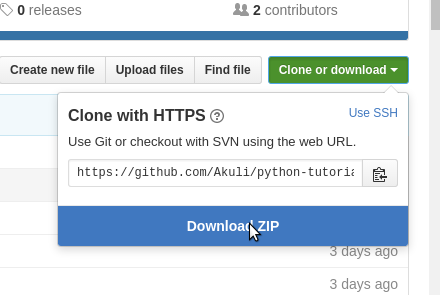

# Python programming tutorial for beginners

This is a concise Python 3 programming tutorial for people who think
that reading is boring. I try to show everything with simple code
examples; there are no long and complicated explanations with fancy
words. If you have never programmed before click
[here](basics/what-is-programming.md) to find out what programming is
like and get started.

This tutorial is aimed at people with no programming experience at all
or very little programming experience. If you have programmed a lot in
the past using some other language you may want to read [the official
tutorial](https://docs.python.org/3/tutorial/) instead.

You can use Python 3.5 or any newer Python with this tutorial. **Don't
use Python 2 because it's no longer supported.**

## List of contents

The tutorial consists of two sections:

### Basics

This section will get you started with using Python and you'll be able
to learn more about whatever you want after studying it.

1. [What is programming?](basics/what-is-programming.md)
2. [Installing Python](basics/installing-python.md)
3. [Getting started with Python](basics/getting-started.md)
4. [ThinkPython: The way of the program](basics/the-way-of-the-program.md)
5. [Variables, Booleans and None](basics/variables.md)
6. [Using functions](basics/using-functions.md)
7. [Setting up an editor](basics/editor-setup.md)
8. [If, else and elif](basics/if.md)
9. [Handy stuff with strings](basics/handy-stuff-strings.md)
10. [Lists and tuples](basics/lists-and-tuples.md)
11. [Loops](basics/loops.md)
12. [Trey Hunner: zip and enumerate](basics/trey-hunner-zip-and-enumerate.md)
13. [Dictionaries](basics/dicts.md)
14. [Defining functions](basics/defining-functions.md)
15. [Writing a larger program](basics/larger-program.md)
16. [What is true?](basics/what-is-true.md)
17. [Files](basics/files.md)
18. [Modules](basics/modules.md)
19. [Exceptions](basics/exceptions.md)
20. [Classes](basics/classes.md)
21. [Docstrings](basics/docstrings.md)

### Advanced

If you want to learn more advanced techniques, you can also read this
section. Most of the techniques explained here are great when you're
working on a large project, and your code would be really repetitive
without these things.

You can experiment with these things freely, but please **don't use these
techniques just because you know how to use them.** Prefer the simple
techniques from the Basics part instead when possible. Simple is better
than complex.

1. [Handy data types](advanced/datatypes.md)
2. [Advanced stuff with functions](advanced/functions.md)
3. [Magic methods](advanced/magicmethods.md)
4. [Iterables, iterators and generators](advanced/iters.md)

### Other things this tutorial comes with

- **Important:** [getting help](getting-help.md)
- [Contact me](contact-me.md)
- Answers for excercises in [basics](basics/answers.md) and
    [advanced](advanced/answers.md) sections
- [The TODO list](TODO.md)

## Frequently asked questions

### How can I thank you for writing and sharing this tutorial?

You can star this tutorial. Starring is free for you, but it tells me
and other people that you like this tutorial.

Go [here](https://github.com/Akuli/python-tutorial) if you aren't here
already and click the "Star" button in the top right corner. You will be
asked to create a GitHub account if you don't already have one.

### How can I read this tutorial without an Internet connection?

1. Go [here](https://github.com/Akuli/python-tutorial) if you aren't
    here already.
2. Click the big green "Clone or download" button in the top right of
    the page, then click "Download ZIP".

    

3. Extract the ZIP and open it. Unfortunately I don't have any more
    specific instructions because how exactly this is done depends on
    which operating system you run.
4. Run `make-html.py` and follow the instructions.

If you have git and you know how to use it, you can also clone the
repository instead of downloading a zip and extracting it. An advantage
with doing it this way is that you don't need to download the whole
tutorial again to get the latest version of it, all you need to do is to
pull with git and run `make-html.py` again.

## Authors

I'm Akuli and I have written most of this tutorial, but other people have helped me with it.
See [github's contributors page](https://github.com/Akuli/python-tutorial/graphs/contributors) for details.

***

If you have trouble with this tutorial please [tell me about
it](./contact-me.md) and I'll make this tutorial better. If you
like this tutorial, please [give it a
star](./README.md#how-can-i-thank-you-for-writing-and-sharing-this-tutorial).

You may use this tutorial freely at your own risk. See
[LICENSE](./LICENSE).

[List of contents](./README.md#list-of-contents)
