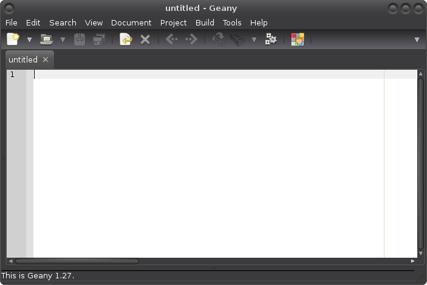

# Setting up an editor for programming

An editor is a program that lets us write longer programs than we can
write on the `>>>` prompt. Then we can save the programs to files and
run them as many times as we want without writing them again.

When programmers say "editor" they don't mean programs like Microsoft
Word or LibreOffice/OpenOffice Writer. These programs are for writing
text documents, not for programming. **Programming editors don't support
things like bigger font sizes for titles or underlining bits of text**,
but instead they have features that are actually useful for programming,
like automatically displaying different things with different colors.

If you are on Windows or Mac OSX you have probably noticed that your
Python came with an editor called IDLE. We are not going to use it
because it's lacking some important features, and most experienced
programmers (including me) don't use it or recommend it to anyone.

In this chapter we'll download, install, set up and learn to use a
better editor. The setup part will take some time, but it's worth it and
correct settings will help you avoid many problems later.

## Which editor should I use?

These instructions are written for an editor called Geany. Its default
settings are actually not very good for writing Python code, but you
will learn to change the settings so you won't have trouble with
switching to another editor later if you need to.

Different programmers have different favorite editors that they use, and
the choice of editor is a very personal thing. You can use almost any
editor you want if you make sure that you change its settings the same
way we change Geany's settings in this tutorial.

## Bad editors

**[Skip this part](#installing-your-new-editor) if you are going to use
Geany.**

But some editors are not good enough for actually making something with
them. These editors cannot be set up using these instructions because
they don't have some of the features we need, so **don't use these
editors for writing Python**:

- Gedit
- IDLE
- Nano
- Notepad
- Pluma
- Wingware

On the other hand, some editors have too many features for getting
started with programming. They are not bad, but they are not meant for
beginners. So **I don't recommend using these editors yet**:

- Emacs
- NetBeans
- PyCharm
- Spyder
- Vim

These lists don't contain all bad editors, but these are editors that
people often try to use. If you know a bad editor and you think I should
mention it here, please [let me know](../contact-me.md).

## Installing your new editor

Installing Geany is easy. If you are using Windows or Mac OSX, go to
[the official Geany download
page](http://www.geany.org/Download/Releases) and click the correct
download link. If you are using Linux, just install Geany from the
package manager like any other program. For example, on Debian-based
distributions (e.g. Ubuntu) you can type `sudo apt install geany` on a
terminal.

When you have Geany installed, you can launch it like any other program.
By default, it has a big sidebar and bottom area, but we don't need them
so you can start by dragging them away. Geany should look roughly like
this after that:



## Dark background

Geany has a white background by default, but we'll tell Geany to use a
black background instead. Your eyes will thank you for doing this when
you have been programming for a few hours.

1. Click *Edit* at top and click *Preferences*.
2. Click *Editor* at left.
3. Click *Display* at top right.
4. Check *Invert syntax highlighting colors*.
5. Click *OK*.

If you don't like the colors, you can install more [color
schemes](https://github.com/geany/geany-themes/) and then go to *View*
at top and click *Change Color Scheme*.

## Opening and saving files

Now it's time to create our first file. Geany creates a new file when
you open it for the first time, but it doesn't know that it's going to
be a Python file. We need to tell that to Geany by saving the file
first. You can use the *File* menu at top or the buttons below the
menus, just like in most other programs.

Save the empty file on your desktop as `test.py`. The `.py` at the end
of the name is important, it tells Geany and other programs that it's a
Python file.

## Automatic tab expanding

Open a Python file in your editor. Then press the tab key, and the
cursor should move right. Now press the left arrow key. See how the
cursor jumps over the empty space? The empty space is actually a tab
character, but Python's style guide recommends using four spaces instead
of tab characters so we'll need to change Geany's settings.

1. Click *Edit* at top, then click Preferences.
2. Click *Editor* at left.
3. Click *Indentation* at top.
4. Select *Spaces* instead of *Tabs*.
5. Click *OK*.
6. Click *Project* at top and click *Apply Default Indentation*.

Delete the whitespace, then press tab and press the arrow left again.
Now the cursor should move one space at a time.

**TODO:** animated gifs that show what's going on.

## Stripping spaces when pressing Enter

Press Tab and then press Enter, and Geany should add spaces to the new
line automatically for you. If you are not using Geany, make sure that
your editor does this too.

Now press the arrow up and then move left and right. You'll notice that
the previous line has spaces left over on it. Leaving useless spaces to
ends of lines like this is usually considered bad style, but it's easy
to tell Geany to get rid of them:

1. Click *Edit* at top and click *Preferences*
2. Click *Editor* at left.
3. Click *Features* at top.
4. Check *Newline strips trailing spaces*.
5. Click *OK*.

Press tab and Enter again. If you go back to the previous line now there
is no whitespace on it.

**TODO:** again, animated gifs

## Maximum line length

You have probably noticed that Geany displays a thin, green-ish line at
right from where you type. The idea is that you should avoid writing
anything longer than where this line is. Your programs will work if they
contain lines that go past this marker, but it's not recommended because
shorter lines are nicer to work with in general. People with small
screens can work with your code, and people with large screens can have
multiple files opened at the same time.

By default, there's room for 72 characters before the marker. Staying in
72 characters is not always easy, and that's why Python's style guide
recommends 79 instead of 72. Let's move Geany's marker to 79 characters:

1. Click *Edit* at top and click *Preferences*
2. Click *Editor* at left.
3. Click *Display* at top.
4. Change 72 to 79.
5. Click *OK*.

## Running things from the editor

This setting up stuff is boring! Let's write some code.

We'll use this program to check if our editor is set up correctly.
Create a new file and type this into it:

```python
import sys
print(sys.version)
```

You don't need to understand this program yet, you'll learn what it does
later in this tutorial. You can type this program on the `>>>` prompt to
see what it does if you want to.

Now save the program somewhere as `test.py`. It doesn't matter what the
name of the file is, but it needs to end with `.py`. This way Geany
knows that it's a Python file.

Next we'll need to change Geany's settings so that it runs the program
correctly. You need to have a Python file opened to change these
settings.

1. Click *Build* at top, then click *Set Build Commands*.
2. The *Execute* command is probably `python "%f"`. Change it to
    `py "%f"` if you are using Windows and `python3 "%f"` if you are
    using Linux or Mac OSX.
3. Click *OK*.

Note that the first part of our *Execute* is the same thing [we type on
a PowerShell or terminal](installing-python.md#running-python). Actually
the whole command means "run this file using my Python".

Now press the F5 key at the top of your keyboard to run the file we
wrote. It should open up in a terminal or command prompt and print the
same Python version as the `>>>` prompt prints when we open it. If the
version starts with 2 it's too old, and you can [ask
me](../contact-me.md) or some other experienced programmer for help.

## Important notes

Now your editor is ready to go. There are a couple important things that
you need to keep in mind when reading the rest of this tutorial:

- When a code example starts with `>>>`, type it to the `>>>` prompt. If
    it doesn't, create or open a `.py` file with your editor, type the
    code into it and run the file.
- When we type some code to the `>>>` prompt it [echoes back the
    result](getting-started.md) [when it's not None](variables.md#none),
    but code in a file does nothing to the result. For example, typing
    `1 + 2` to the `>>>` prompt makes it echo `3`, but we need to do
    `print(1 + 2)` if we want to do the same thing in a file.

## You're done!

This probably felt like a lot of work, but don't worry, there will be no
more things like this in the future. Now we have installed and set up
all the tools we need and we can continue learning Python.
