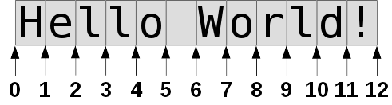
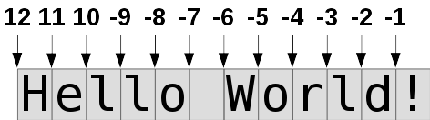
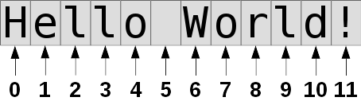
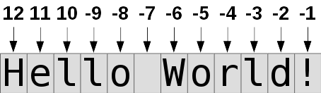
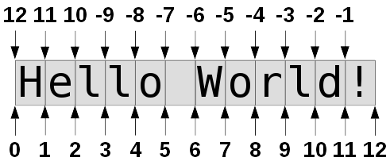
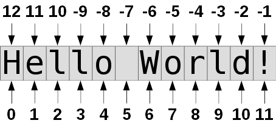

# Handy stuff: Strings

Python strings are just pieces of text.

```python
>>> our_string = "Hello World!"
>>> our_string
'Hello World!'
>>>
```

So far we know how to add them together.

```python
>>> "I said: " + our_string
'I said: Hello World!'
>>>
```

We also know how to repeat them multiple times.

```python
>>> our_string * 3
'Hello World!Hello World!Hello World!'
>>>
```

Python strings are [immutable](https://docs.python.org/3/glossary.html#term-immutable).
That's just a fancy way to say that
they cannot be changed in-place, and we need to create a new string to
change them. Even `some_string += another_string` creates a new string.
Python will treat that as `some_string = some_string + another_string`,
so it creates a new string but it puts it back to the same variable.

`+` and `*` are nice, but what else can we do with strings?

## Slicing

Slicing is really simple. It just means getting a part of the string.
For example, to get all characters between the second place between the
characters and the fifth place between the characters, we can do this:

```python
>>> our_string[2:5]
'llo'
>>>
```

So the syntax is like `some_string[start:end]`.

This picture explains how the slicing works:



But what happens if we slice with negative values?

```python
>>> our_string[-5:-2]
'orl'
>>>
```

It turns out that slicing with negative values simply starts counting
from the end of the string.



If we don't specify the beginning it defaults to 0, and if we don't
specify the end it defaults to the length of the string. For example, we
can get everything except the first or last character like this:

```python
>>> our_string[1:]
'ello World!'
>>> our_string[:-1]
'Hello World'
>>>
```

Remember that strings can't be changed in-place.

```python
>>> our_string[:5] = 'Howdy'
Traceback (most recent call last):
  File "<stdin>", line 1, in <module>
TypeError: 'str' object does not support item assignment
>>>
```

There's also a step argument we can give to our slices, but I'm not
going to talk about it now.

## Indexing

So now we know how slicing works. But what happens if we forget the `:`?

```python
>>> our_string[1]
'e'
>>>
```

That's interesting. We got a string that is only one character long. But
the first character of `Hello World!` should be `H`, not `e`, so why did
we get an e?

Programming starts at zero. Indexing strings also starts at zero. The
first character is `our_string[0]`, the second character is
`our_string[1]`, and so on.

```python
>>> our_string[0]
'H'
>>> our_string[1]
'e'
>>> our_string[2]
'l'
>>> our_string[3]
'l'
>>> our_string[4]
'o'
>>>
```

So string indexes work like this:



How about negative values?

```python
>>> our_string[-1]
'!'
>>>
```

We got the last character.

But why didn't that start at zero? `our_string[-1]` is the last
character, but `our_string[1]` is not the first character!

That's because 0 and -0 are equal, so indexing with -0 would do the same
thing as indexing with 0.

Indexing with negative values works like this:



## String methods

Python's strings have many useful methods.
[The official documentation](https://docs.python.org/3/library/stdtypes.html#string-methods)
covers them all, but I'm going to just show some of the most commonly
used ones briefly. Python also comes with built-in documentation about
the string methods and we can run `help(str)` to read it. We can also
get help about one string method at a time, like `help(str.upper)`.

Again, nothing can modify strings in-place. Most string methods
return a new string, but things like `our_string = our_string.upper()`
still work because the new string is assigned to the old variable.

Also note that all of these methods are used like `our_string.stuff()`,
not like `stuff(our_string)`. The idea with that is that our string
knows how to do all these things, like `our_string.stuff()`, we don't
need a separate function that does these things like `stuff(our_string)`.
We'll learn more about methods [later](classes.md).

Here's an example with some of the most commonly used string methods:

```python
>>> our_string.upper()
'HELLO WORLD!'
>>> our_string.lower()
'hello world!'
>>> our_string.startswith('Hello')
True
>>> our_string.endswith('World!')
True
>>> our_string.endswith('world!')  # Python is case-sensitive
False
>>> our_string.replace('World', 'there')
'Hello there!'
>>> our_string.replace('o', '@', 1)   # only replace one o
'Hell@ World!'
>>> '  hello 123  '.lstrip()    # left strip
'hello 123  '
>>> '  hello 123  '.rstrip()    # right strip
'  hello 123'
>>> '  hello 123  '.strip()     # strip from both sides
'hello 123'
>>> '  hello abc'.rstrip('cb')  # strip c's and b's from right
'  hello a'
>>> our_string.ljust(30, '-')
'Hello World!------------------'
>>> our_string.rjust(30, '-')
'------------------Hello World!'
>>> our_string.center(30, '-')
'---------Hello World!---------'
>>> our_string.count('o')   # it contains two o's
2
>>> our_string.index('o')   # the first o is our_string[4]
4
>>> our_string.rindex('o')  # the last o is our_string[7]
7
>>> '-'.join(['hello', 'world', 'test'])
'hello-world-test'
>>> 'hello-world-test'.split('-')
['hello', 'world', 'test']
>>> our_string.upper()[3:].startswith('LO WOR')  # combining multiple things
True
>>>
```

The things in square brackets that the split method gave us and
we gave to the join method were lists. We'll talk more about
them [later](lists-and-tuples.md).

## String formatting

To add a string in the middle of another string, we can do something
like this:

```python
>>> name = 'Akuli'
>>> 'My name is ' + name + '.'
'My name is Akuli.'
>>>
```

But that gets complicated if we have many things to add.

```python
>>> channel = '##learnpython'
>>> network = 'freenode'
>>> "My name is " + name + " and I'm on the " + channel + " channel on " + network + "."
"My name is Akuli and I'm on the ##learnpython channel on freenode."
>>>
```

Instead it's recommended to use string formatting. It means putting
other things in the middle of a string.

Python has multiple ways to format strings. One is not necessarily
better than others, they are just different. Here's a few ways to solve
our problem:

- `.format()`-formatting, also known as new-style formatting. This
    formatting style has a lot of features, but it's a little bit more
    typing than `%s`-formatting.

    ```python
    >>> "Hello {}.".format(name)
    'Hello Akuli.'
    >>> "My name is {} and I'm on the {} channel on {}.".format(name, channel, network)
    "My name is Akuli and I'm on the ##learnpython channel on freenode."
    >>>
    ```

- `%s`-formatting, also known as old-style formatting. This has less
    features than `.format()`-formatting, but `'Hello %s.' % name` is
    shorter and faster to type than `'Hello {}.'.format(name)`. I like
    to use `%s` formatting for simple things and `.format` when I need
    more powerful features.

    ```python
    >>> "Hello %s." % name
    'Hello Akuli.'
    >>> "My name is %s and I'm on the %s channel on %s." % (name, channel, network)
    "My name is Akuli and I'm on the ##learnpython channel on freenode."
    >>>
    ```

    In the second example we had `(name, channel, network)` on the right
    side of the `%` sign. It was a tuple, and we'll talk more about them
    [later](lists-and-tuples.md#tuples).

    If we have a variable that may be a tuple we need to wrap it in another
    tuple when formatting:

    ```python
    >>> thestuff = (1, 2, 3)
    >>> "we have %s" % thestuff
    Traceback (most recent call last):
      File "<stdin>", line 1, in <module>
    TypeError: not all arguments converted during string formatting
    >>> "we have %s and %s" % ("hello", thestuff)
    'we have hello and (1, 2, 3)'
    >>> "we have %s" % (thestuff,)
    'we have (1, 2, 3)'
    >>>
    ```

    Here `(thestuff,)` was a tuple that contained nothing but `thestuff`.

- f-strings are even less typing, but new in Python 3.6. **Use this only if
    you know that nobody will need to run your code on Python versions older
    than 3.6.** Here the f is short for "format", and the content of the
    string is same as it would be with `.format()` but we can use variables
    directly.

    ```python
    >>> f"My name is {name} and I'm on the {channel} channel on {network}."
    "My name is Akuli and I'm on the ##learnpython channel on freenode."
    >>>
    ```

All of these formatting styles have many other features also:

```python
>>> 'Three zeros and number one: {:04d}'.format(1)
'Three zeros and number one: 0001'
>>> 'Three zeros and number one: %04d' % 1
'Three zeros and number one: 0001'
>>>
```

If you need to know more about formatting I recommend reading
[this](https://pyformat.info/).

## Other things

We can use `in` and `not in` to check if a string contains another
string.

```python
>>> our_string = "Hello World!"
>>> "Hello" in our_string
True
>>> "Python" in our_string
False
>>> "Python" not in our_string
True
>>>
```

We can get the length of a string with the `len` function. The name
`len` is short for "length".

```python
>>> len(our_string)   # 12 characters
12
>>> len('')     # no characters
0
>>> len('\n')    # python thinks of \n as one character
1
>>>
```

We can convert strings, integers and floats with each other with
`str`, `int` and `float`. They aren't actually functions, but they
behave a lot like functions. We'll learn more about what they really
are [later](classes.md).

```python
>>> str(3.14)
'3.14'
>>> float('3.14')
3.14
>>> str(123)
'123'
>>> int('123')
123
>>>
```

Giving an invalid string to `int` or `float` produces an error
message.

```python
>>> int('lol')
Traceback (most recent call last):
  File "<stdin>", line 1, in <module>
ValueError: invalid literal for int() with base 10: 'lol'
>>> float('hello')
Traceback (most recent call last):
  File "<stdin>", line 1, in <module>
ValueError: could not convert string to float: 'hello'
>>>
```

## Summary

- Slicing returns a copy of a string with indexes from one index to
    another index. The indexes work like this:

    

- Indexing returns one character of a string. Remember that we don't
    need a `:` with indexing. The indexes work like this:

    

- Python has many string methods. Use
    [the documentation](https://docs.python.org/3/library/stdtypes.html#string-methods)
    or `help(str)` when you don't rememeber something about them.
- String formatting means adding other things to the middle of a string.
    There are multiple ways to do this in Python. You should know how to
    use at least one of these ways.
- The `in` keyword can be used for checking if a string contains another
    string.
- `len(string)` returns string's length.
- We can use `str`, `int` and `float` to convert values to different
    types.

## Exercises

1. Fix this program.

    ```python
    print("Hello!")
    word1 = input("Enter something: ")
    word2 = input("Enter another thing: ")
    word3 = input("Enter a third thing: ")
    word4 = input("And yet another thing: ")
    print("You entered " + word1 + ", " + word2 + ", " + word3 + " and " + word4 + ".")
    ```

2. This program is supposed to say something loudly. Fix it.

    ```python
    message = input("What do you want me to say? ")
    message.upper
    print(message, "!!!")
    print(message, "!!!")
    print(message, "!!!")
    ```

The answers are [here](answers.md#handy-stuff-strings).

***

If you have trouble with this tutorial please [tell me about
it](../contact-me.md) and I'll make this tutorial better. If you
like this tutorial, please [give it a
star](../README.md#how-can-i-thank-you-for-writing-and-sharing-this-tutorial).

You may use this tutorial freely at your own risk. See
[LICENSE](../LICENSE).

[Previous](if.md) | [Next](lists-and-tuples.md) |
[List of contents](../README.md#basics)
