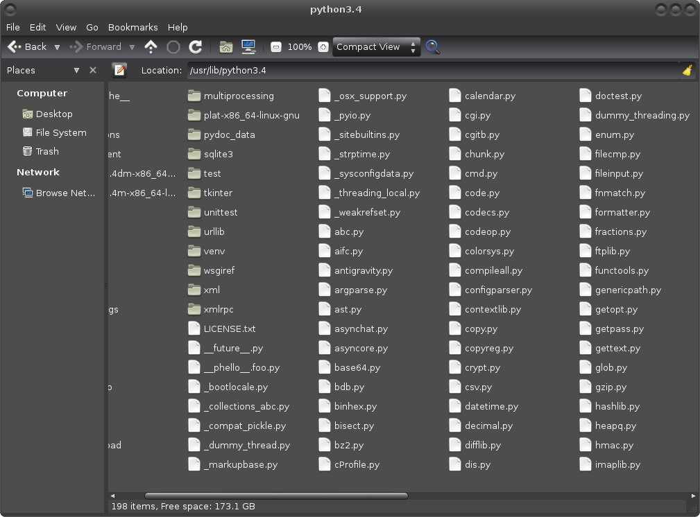

# Modules

Let's say we want to generate a random number between 1 and 3.
The random module is a really easy way to do this:

```python
>>> import random
>>> random.randint(1, 3)
3
>>> random.randint(1, 3)
1
>>> random.randint(1, 3)
3
>>> random.randint(1, 3)
2
>>> random.randint(1, 3)
2
>>>
```

That's cool... but how does that work?

## What are modules?

The first line in the example, `import random`, was an
**import statement.** But what is that random thing that it
gave us?

```python
>>> random
<module 'random' from '/usr/lib/python3.4/random.py'>
>>>
```

So it's a module, and it comes from a path... but what does
all that mean?

Now open the folder that contains your `random.py` is. On my
system it's `/usr/lib/python3.4`, but yours will probably be
different. To open a folder in your file manager you can press
Windows-R on Windows or Alt+F2 on most GNU/Linux distributions,
and just type your path there. I don't have an up-to-date copy
of OSX so unfortunately I have no idea what you need to do on
OSX.

You'll see a bunch of files and a few directories in the folder
that opens:



All of these `.py` files can be imported like we just imported
`random.py`. In random.py, there's a line like `randint = something`,
so we can use its randint variable with `random.randint` after
importing it.

You're probably wondering how a computer can generate random numbers.
The random module does different things on different operating systems,
but on most systems it reads random noise that several programs on the
computer produce and creates random numbers based on that.

## Where do modules come from?

Create a `random.py` file with the following content:

```python
import random

print("A random number between 1 and 3:", random.randint(1, 3))
```

Now run the program.

```python
Traceback (most recent call last):
  File "random.py", line 1, in <module>
    import random
  File "/home/akuli/random.py", line 4, in <module>
    print("A random number between 1 and 3:", random.randint(1, 3))
AttributeError: 'module' object has no attribute 'randint'
```

But what was that? Why didn't it work?

**TODO:** update the `-i` instructions.

Let's go ahead and check what's wrong. If you don't use IDLE, you'll
need to pass the `-i` option to Python, so if you would normally run
`python3 random.py` you should now do `python3 -i random.py`. This will
run the file and then give you a `>>>` prompt that we can use to check
what's wrong. If you use IDLE, just run the file normally.

We should end up with the same error message, and then a `>>>`.
Like this:

```python
Traceback (most recent call last):
  File "random.py", line 1, in <module>
    import random
  File "/home/akuli/random.py", line 4, in <module>
    print("A random number between 1 and 3:", random.randint(1, 3))
AttributeError: 'module' object has no attribute 'randint'
>>>
```

So first of all, what is that `random` variable?

```python
>>> random
<module 'random' from '/home/akuli/random.py'>
>>>
```

What the heck? It's a module called random... but it's not the
`random.py` we thought it was. **Our** `random.py` has imported
itself!

So let's go ahead and rename our file from `random.py` to
something like `ourrandom.py` and try again:

```
A random number between 1 and 3: 3
```

There we go, now we don't have our own `random.py` so it works.

So seems like that modules can be imported from the directory that
our Python file is in, and also from the directory that the real
`random.py` is in. But where else can they come from?

There's a module called **sys** that contains various things built
into Python. Actually the whole module is built-in, so there's no
`sys.py` anywhere. The sys module has a list that contains all
places that modules are searched from:

```python
>>> import sys
>>> sys
<module 'sys' (built-in)>
>>> sys.path
['',
 '/usr/lib/python3.4',
 '/usr/lib/python3.4/plat-i386-linux-gnu',
 '/usr/lib/python3.4/lib-dynload',
 '/home/akuli/.local/lib/python3.4/site-packages',
 '/usr/local/lib/python3.4/dist-packages',
 '/usr/lib/python3/dist-packages']
>>>
```

So that's where my Python finds its modules. The first thing in my
sys.path is an empty string, and in this case it means the current
working directory.

## Caching modules

Let's create a file called `hello.py` that contains a classic greeting:

```python
print("Hello World!")
```

Let's go ahead and import it, and see how it works.

```python
>>> import hello
Hello World!
>>>
```

Works as expected, but what happens if we try to import it again?

```python
>>> import hello
>>>
```

Nothing happened at all.

The reason why the module wasn't loaded twice is simple. In a
large project with many files it's normal to import the same
module in many files, so it gets imported multiple times. If
Python would reload the module every time it's imported,
dividing code to multiple files would make the code run slower.

If we need to load the module again we can just exit out of Python and
launch it again.

## Brief overview of the standard library

The **standard library** consists of modules that Python comes
with. Here's a very brief overview of what it can do. All of
these modules can also do other things, and you can read more
about that in the official documentation.

### Random numbers

The official documentation is
[here](https://docs.python.org/3/library/random.html).

```python
>>> import random
>>> random.randint(1, 3)      # 1, 2 or 3
3
>>> colors = ['red', 'blue', 'yellow']
>>> random.choice(colors)     # choose one color
'red'
>>> random.sample(colors, 2)  # choose two different colors
['yellow', 'red']
>>> random.shuffle(colors)    # mix the color list in-place
>>> colors
['yellow', 'red', 'blue']
>>>
```

### Things that are built into Python

The module name "sys" is short for "system", and it contains things
that are built into Python. The official documentation is
[here](https://docs.python.org/3/library/sys.html).

`sys.stdin`, `sys.stdout` and `sys.stderr` are [file objects](files.md),
just like the file objects that `open()` gives us.

```python
>>> import sys
>>> print("Hello!", file=sys.stdout)  # this is where prints go by default
Hello!
>>> print("Hello!", file=sys.stderr)  # use this for error messages
Hello!
>>> line = sys.stdin.readline()  # i will type hello and press enter
hello
>>> line
'hello\n'
>>>
>>> # information about Python's version, behaves like a tuple
>>> sys.version_info
sys.version_info(major=3, minor=4, micro=2, releaselevel='final', serial=0)
>>> sys.version_info[:3]  # this is Python 3.4.2
(3, 4, 2)
>>>
>>> sys.exit()  # exit out of Python
```

**TODO:** why stderr instead of stdout.

`sys.exit()` does the same thing as `sys.exit(0)`. The zero means that
the program succeeded, and everything's fine. If our program has an
error we should print an error message to `sys.stderr` and then call
`sys.exit(1)`. Like this:

```python
if something_went_wrong:
    # of course, we need to make real error messages more
    # informative than this example is
    print("Oh crap! Something went wrong.", file=sys.stderr)
    sys.exit(1)
```

### Mathematics

There's no math.py anywhere, math is a built-in module like
sys. The official documentation is
[here](https://docs.python.org/3/library/math.html).

```python
>>> import math
>>> math
<module 'math' (built-in)>
>>> math.pi                  # approximate value of π
3.141592653589793
>>> math.sqrt(2)             # square root of 2
1.4142135623730951
>>> math.radians(180)        # convert degrees to radians
3.141592653589793
>>> math.degrees(math.pi/2)  # convert radians to degrees
90.0
>>> math.sin(math.pi/2)      # sin of 90 degrees or 1/2 π radians
1.0
>>>
```

### Time-related things

The official documentation for the time module is
[here](https://docs.python.org/3/library/time.html).

```python
>>> import time
>>> time.sleep(1)   # wait one second
>>> time.time()     # return time in seconds since beginning of the year 1970
1474896325.2394648
>>> time.strftime('%d.%m.%Y %H:%M:%S')  # format current time nicely
'07.04.2017 19:08:33'
>>>
```

You are probably wondering how `time.time()` can be used and why its
timing starts from the beginning of 1970. `time.time()` is useful for
measuring time differences because we can save its return value to a
variable before doing something, and then afterwards check how much it
changed. There's an example that does this in [the example
section](#examples).

If you want to know why it starts from 1970 you can read something like
[this](http://stackoverflow.com/questions/1090869/why-is-1-1-1970-the-epoch-time).
See `help(time.strftime)` if you want to know about more format
specifiers like `%d`, `%m` etc. that `time.strftime` can take.

### Operating system related things

The module name "os" is short for "operating system", and it contains
handy functions for interacting with the operating system that Python
is running on. The official documentation is
[here](https://docs.python.org/3/library/os.html).

```python
>>> import os
>>> os.getcwd()        # short for "get current working directory"
'/home/akuli'
>>> os.mkdir('stuff')  # create a folder, short for "make directory"
>>>
>>> os.path.isfile('hello.txt')  # check if it's a file
True
>>> os.path.isfile('stuff')
False
>>> os.path.isdir('hello.txt')   # check if it's a directory
False
>>> os.path.isdir('stuff')
True
>>> os.path.exists('hello.txt')  # check if it's anything
True
>>> os.path.exists('stuff')
True
>>>
>>> # this joins with '\\' on windows and '/' on most other systems
>>> path = os.path.join('stuff', 'hello-world.txt')
>>> path
'stuff/hello-world.txt'
>>> with open(path, 'w') as f:
...     # now this goes to the stuff folder we created
...     print("Hello World!", file=f)
...
>>> os.listdir('stuff')  # create a list of everything in stuff
['hello-world.txt']
>>>
```

## Examples

Mix a list of things.

```python
import random

print("Enter things to mix, and press Enter without typing",
      "anything when you're done.")
things = []
while True:
    thing = input("Next thing: ")
    if thing == "":
        break
    things.append(thing)

random.shuffle(things)

print("After mixing:")
for thing in things:
    print(thing)
```

Measure how long it takes for the user to answer a question.
The `%.2f` rounds to 2 decimals, and you can find more formatting
tricks [here](https://pyformat.info/).

```python
import time

start = time.time()
answer = input("What is 1 + 2? ")
end = time.time()
difference = end - start

if answer == '3':
    print("Correct! That took %.2f seconds." % difference)
else:
    print("That's not correct...")
```

Wait a given number of seconds.

```python
import sys
import time


answer = input("How long do you want to wait in seconds? ")
waitingtime = float(answer)
if waitingtime < 0:
    print("Error: cannot wait a negative time.", file=sys.stderr)
    sys.exit(1)

print("Waiting...")
time.sleep(waitingtime)
print("Done!")
```

Check what a path points to.

```python
import os
import sys

print("You are currently in %s." % os.getcwd())

while True:
    path = input("A path, or nothing at all to quit: ")
    if path == '':
        # We could just break out of the loop, but I'll show how
        # this can be done with sys.exit. The difference is that
        # break only breaks the innermost loop it is in, and
        # sys.exit ends the whole program.
        sys.exit()
    if os.path.isfile(path):
        print("It's a file!")
    elif os.path.isdir(path):
        print("It's a folder!")
    elif os.path.exists(path):
        # i have no idea when this code would actually run
        print("Interesting, it exists but it's not a file or a folder.")
    else:
        print("I can't find it :(", file=sys.stderr)
```

## More modules!

Python's standard library has many awesome modules and I just
can't tell about each and every module I use here. Here's some of
my favorite modules from the standard library. Don't study them
one by one, but look into them when you think you might need them.
When reading the documentation it's usually easiest to find what
you are looking for by pressing Ctrl+F in your web browser, and
then typing in what you want to search for.

- [argparse](https://docs.python.org/3/howto/argparse.html):
    a full-featured command-line argument parser
- [collections](https://docs.python.org/3/library/collections.html),
    [functools](https://docs.python.org/3/library/functools.html) and
    [itertools](https://docs.python.org/3/library/itertools.html):
    handy utilities
- [configparser](https://docs.python.org/3/library/configparser.html):
    load and save setting files
- [csv](https://docs.python.org/3/library/csv.html):
    store comma-separated lines in files
- [json](https://docs.python.org/3/library/json.html):
    yet another way to store data in files and strings
- [textwrap](https://docs.python.org/3/library/textwrap.html):
    break long text into multiple lines
- [warnings](https://pymotw.com/3/warnings/):
    like [exceptions](exceptions.md), but they don't interrupt the
    whole program
- [webbrowser](https://pymotw.com/3/webbrowser/):
    open a web browser from Python

I also use these modules, but they don't come with Python so you'll
need to install them yourself if you want to use them:

- [appdirs](https://github.com/activestate/appdirs):
    an easy way to find out where to put setting files
- [requests](http://docs.python-requests.org/en/master/user/quickstart/):
    an awesome networking library

I recommend reading [the official documentation about installing
modules](https://docs.python.org/3/installing/). If you're using
GNU/Linux also read the "Installing into the system Python on Linux"
section at the bottom.

## Summary

- Most modules are files on our computers, but some of them are built
    in to Python. We can use modules in our projects by importing them,
    and after that using `modulename.variable` to get a variable from
    the module.
- Some of the most commonly used modules are random, sys, math, time
    and os.
- Avoid creating `.py` files that have the same name as a name of a
    module you want to use.
- Python comes with many modules, and we can install even more modules
    if we want to.

**TODO:** exercises

***

If you have trouble with this tutorial please [tell me about
it](../contact-me.md) and I'll make this tutorial better. If you
like this tutorial, please [give it a
star](../README.md#how-can-i-thank-you-for-writing-and-sharing-this-tutorial).

You may use this tutorial freely at your own risk. See
[LICENSE](../LICENSE).

[Previous](files.md) | [Next](exceptions.md) |
[List of contents](../README.md#basics)
