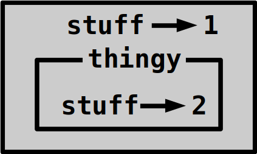

# More Classes

Read the [classes](classes.md) and
[writing a larger program](larger-program.md) chapters if you haven't read them
yet. In this chapter you'll learn how to use classes when writing larger
programs, and how to avoid things that cause problems when you want to write
larger programs.


## Global

Python has a `global` keyword. I haven't talked about it before, and that is
for a reason. Let's look at this:

```python
>>> stuff = 1
>>> def thingy():
...     stuff = 2
... 
>>> thingy()
>>> stuff   # this did NOT change to 2
1
>>> 
```

The problem is that `stuff` is a
[local variable](defining-functions.md#locals-and-globals) inside the
`thingy` function. There are actually two variables called `stuff`; the
local `stuff` in `thingy`, and the global `stuff`:



Of course, this is bad style because it's very confusing. To fix this, you
"can" use `global` like this (but **that's not the best way to fix it**,
see below):

```python
def thingy():
    global stuff
    stuff = 2
```

Now the global `stuff` variable gets changed instead of creating a new variable.
Note that you only need `global` when **setting** a variable. This function
doesn't need `global`, and it's unnecessary to use `global` here:

```python
def show_stuff():
    # global is not needed here, don't put it here
    print('The stuff is:', stuff)
```

**Using global variables is bad** in general. To see why, look at this program:

```python
# THIS CODE IS BAD

def ask_name():
    global name
    name = input("Enter your name: ")

def create_message():
    global message
    message = "Hello" + name

def show_message():
    print(message)

def main():
    ask_name()
    create_message()
    show_message()

if __name__ == '__main__':
    main()
```

The `__name__ == '__main__'` thing is explained
[here](larger-program.md#the-main-function). The code would be much simpler
without functions, but imagine that each function is about 20 lines long. Then
the code would be much harder to understand if it wasn't divided into multiple
functions.

This code doesn't work correctly, and our job is to figure out which line is
wrong. If you run it and enter `Blah` when it asks for the name, it prints
`HelloBlah` instead of `Hello Blah`. Let's guess that `create_message()` is
broken, and try to run just that function without running anything else:

```python
>>> import globalprogram    # the program must be saved to globalprogram.py
>>> globalprogram
<module 'globalprogram' from '/home/akuli/globalprogram.py'>
>>> globalprogram.create_message()
Traceback (most recent call last):
  File "<stdin>", line 1, in <module>
  File "/home/akuli/globalprogram.py", line 9, in create_message
    message = "Hello" + name
NameError: name 'name' is not defined
>>>
```

This didn't work at all because `ask_name()` should have created the `name`
variable, but we wanted to run `create_message()` without `ask_name()`. This is
bad, because now we need to use `ask_name()` if we want to do anything at all
with `create_message`. This may not seem very bad, but imagine what happens if
`ask_name` was instead something that took about 10 minutes to complete, or
something that you don't want to run for some other reason. Also, if
we use `ask_name` and `create_message` and it doesn't work, we don't know which
function has the problem unless we can somehow run one of them without the
other.

Next, imagine that someone sent you this code, and you have never seen it
before. If you look at the code of `create_message`, can you figure out which
things it needs to run, and what it produces as a result? These things are
important when you are trying to understand code that you have never seen
before. You need to read these 2 lines of code in it to figure it out...

```python
global message
message = "Hello" + name
```

...and notice that they use `name` and set `message`. Again, this might not
seem very bad, but imagine the same thing with 10 functions that do stuff with
20 different variables instead of 3 functions that do stuff with 2 variables.
Each function could also contain much more lines of code.

If you still don't believe that global variables are bad, search for
`python why are global variables bad`. Some of the reasons you will find show
up mostly in large projects, so I don't have good and short examples of them
here, but I want to teach you to do things in ways that also work well when
your projects get larger.


## Avoiding global variables with arguments and return values

Now you have seen why global variables are bad, so let's
[write the code with arguments and return values](larger-program.md)
instead of global variables.

```python
# this code is not bad

def ask_name():
    name = input("Enter your name: ")
    return name

def create_message(name):
    message = "Hello" + name
    return message

def show_message(message):
    print(message)

def main():
    name = ask_name()
    message = create_message(name)
    show_message(message)

if __name__ == '__main__':
    main()
```

The code still prints `HelloBlah` instead of `Hello Blah`, but now we can
figure out where the problem is. Let's try running `create_message` again:

```python
>>> import globalprogram    # the program must be saved to globalprogram.py
>>> globalprogram
<module 'globalprogram' from '/home/akuli/globalprogram.py'>
>>> globalprogram.create_message()
Traceback (most recent call last):
  File "<stdin>", line 1, in <module>
TypeError: create_message() missing 1 required positional argument: 'name'
>>> 
```

We got an error again, but this time the error tells us exactly what's wrong:

```python
>>> globalprogram.create_message('Blah')
'HelloBlah'
```

Now we know that `create_message` is broken, and to see why, we can try running
some of the code inside it:

```python
>>> "Hello" + "Blah"
'HelloBlah'
>>> "Hello " + "Blah"
'Hello Blah'
>>>
```

Now we know how to fix the code. We just need to replace `"Hello"` with
`"Hello "` to get a space before the name, and it'll work better.


## Avoiding global variables with a class

Arguments and return values work well for small programs, but what if your
program is bigger? For example, this program asks lots of information from the
user, checks whether it's correctly entered, and if it is, it writes it to a
file.

```python
# THIS CODE IS BAD

def ask_user_info():
    global user_name
    global full_name
    global room_number
    global work_phone_number
    global personal_phone_number

    user_name = input("User name: ")
    full_name = input("Full name: ")
    room_number = input("Room number: ")
    work_phone_number = input("Work phone number: ")
    personal_phone_number = input("Personal phone number (a phone number not for work): ")


# returns an error message, or None if everything is ok
def validate_user_info():
    if (user_name == '' or
        full_name == '' or
        room_number == '' or
        work_phone_number == '' or
        personal_phone_number == ''):
        return "something was left blank"

    try:
        if int(room_number) <= 0:
            # room_number is '0', or negative (e.g. '-2')
            return "room number must be positive"
    except ValueError:
        # int(room_number) failed, room_number is e.g. 'lol'
        return "room number is not an integer"

    if ' ' in user_name:
        return "username contains a space"
    if '/' in user_name:
        return "username contains a slash"

    return None


def create_user_info_file_name():
    global file_name
    file_name = 'user_info_' + user_name + '.txt'


def display_user_info():
    print("User name:", user_name)
    print("Full name:", full_name)
    print("Room number:", room_number)
    print("Work phone number:", work_phone_number)
    print("Personal phone number:", personal_phone_number)


def write_user_info_to_file():
    print("Writing to file:", file_name)
    with open(file_name, 'w') as f:
        print('user_name =', user_name, file=f)
        print('full_name =', full_name, file=f)
        print('room_number =', room_number, file=f)
        print('work_phone_number =', work_phone_number, file=f)
        print('personal_phone_number =', personal_phone_number, file=f)


def main():
    while True:
        ask_user_info()
        error = validate_user_info()
        if error is None:
            break

        print()
        print("Error:", error)
        print("Please try again.")
        print()

    print()
    print("Here's the information you entered:")
    display_user_info()
    print()

    create_user_info_file_name()
    write_user_info_to_file()


if __name__ == '__main__':
    main()
```

The code is quite long because **classes are not usually needed for smaller programs**.
If you can return things and take arguments instead, do that. It
won't work very well in this case, because the code would end up looking like
this:

```python
def ask_user_info():
    ...
    return (user_name, full_name, room_number, work_phone_number, personal_phone_number)

def validate_user_info(user_name, full_name, room_number, work_phone_number, personal_phone_number):
    ...

def display_user_info(user_name, full_name, room_number, work_phone_number, personal_phone_number):
    ...
```

That's annoying. We don't want that. Let's use a class instead.

- We had too many variables, so we'll put all of them into a class:

    ```python
    class UserInfo:

        def __init__(self, user_name, full_name, room_number, work_phone_number, personal_phone_number):
            self.user_name = user_name
            self.full_name = full_name
            self.room_number = room_number
            self.work_phone_number = work_phone_number
            self.personal_phone_number = personal_phone_number
    ```

- `ask_user_info` can now return a `UserInfo` object:

    ```python
    def ask_user_info():
        return UserInfo(
            user_name=input("User name: "),
            full_name=input("Full name: "),
            room_number=input("Room number: "),
            work_phone_number=input("Work phone number: "),
            personal_phone_number=input("Personal phone number (a phone number not for work): "),
        )
    ```

- `validate_user_info` can be a method of the `UserInfo` class. This way it's
  also obvious that it does something with user info, so we can call it
  `validate` instead of `validate_user_info`.

    ```python
    class UserInfo:
        ...
        def validate(self)
            if (self.user_name == '' or
                self.full_name == '' or
                self.room_number == '' or
                ...
    ```

- `create_user_info_file_name` can return the file name.

    There's no reason why
    you couldn't also use arguments and return values when you use a class. Use
    whatever is easiest. In this case, setting the file name to
    `self.file_name` or something would mean that the method has to be called
    before `self.file_name` is used anywhere. That would give the same problem
    that we had earlier with global variables not being defined. This doesn't
    happen with other `self.something` attributes because they are defined in
    `__init__`, so they are never missing.

    I'll also rename the method to `get_file_name` instead of e.g.
    `create_file_name` to give the reader of the code a hint that it might
    return the file name.

    ```python
    class UserInfo:
        ...
        def get_file_name(self):
            return 'user_info_' + self.user_name + '.txt'
        ...
    ```

- `display_user_info` and `write_user_info_to_file` can be converted to methods
  just like `validate_user_info`. I'll call them `display` and `write_to_file`.
  My `write_to_file` method uses `self.get_file_name()` instead of `file_name`,
  but it could also take `file_name` as an argument. Both ways are good.

    ```python
    class UserInfo:
        ...
        def write_to_file(self):
            file_name = self.get_file_name()
            print("Writing to file:", file_name)
            with open(file_name, 'w') as f:
                ...
    ```

- `main` needs to be modified more:

    ```python
    def main():
        while True:
            user_info = ask_user_info()
            error = user_info.validate()
            if error is None:
                break

            print()
            print("Error:", error)
            print("Please try again.")
            print()

        print()
        print("Here's the information you entered:")
        user_info.display()
        print()

        user_info.write_to_file()
    ```

Now we have a program that doesn't use global variables. If it doesn't work,
you can import it and try out all the things as usual, and figure out what's
wrong:

```python
>>> import userinfo     # save the program to userinfo.py
>>> info = userinfo.UserInfo('a', 'b', 'lol', '123-456-7890', '123-456-7890')
>>> info
<userinfo.UserInfo object at 0x7fd110f8ac88>
>>> info.display()
User name: a
Full name: b
Room number: lol
Work phone number: 123-456-7890
Personal phone number: 123-456-7890
>>> info.validate()
'room number is not an integer'
>>>
```


## Exercises

**TODO:** a longer cleanup exercise where using a class is good

1. Clean up this code.

```python
import random


def change_words_order():
    global sentence
    no_dots_sentence = sentence.replace('.', '')
    global words
    words = no_dots_sentence.split()
    global it_was_empty
    if len(words) == 0:
        it_was_empty = True
    else:
        it_was_empty = False
        global lowercase_words
        lowercase_words = []
        for word in words:
            lowercase_words.append(word.lower())
        random.shuffle(lowercase_words)

        # in lowercase_words[0], first character uppercase, rest lowercase
        # note that empty_list_or_empty_string[0] doesn't work
        # lowercase_words is not empty because len(words) == 0 was handled separately
        # lowercase_words[0] is not empty because it came from .split()
        lowercase_words[0] = lowercase_words[0][0].upper() + lowercase_words[0][1:]
        sentence = ' '.join(lowercase_words) + '.'


def main():
    global sentence
    print("This program changes the order of the words of a sentence randomly.")
    print()

    while True:
        sentence = input('Enter a sentence: ')
        change_words_order()
        if not it_was_empty:
            print(sentence)

if __name__ == '__main__':
    main()
```

2. Create a program that does something. Use global variables first. Clean up
   the program in two ways, with a class and with arguments and return values.
   Which cleaned up program is cleaner?

3. Create a program that does something. Don't use global variables at all.

4. My username validation code is not very good. For example, it says that
   `my @$$` is a valid user name. Write better username validating code
   that doesn't allow usernames to contain anything else than digits
   `0`, `1`, `2`, ..., `9`, uppercase and lowercase letters `a` to `z`, and
   dashes `-`. For example, `my-UserName-123` is valid, but `my @$$` is not.
   (Hint: You don't need to write all the letters `ABCDEF...XYZabc...xyz` or
   the digits `0123...9` to your code if you `ascii_letters` and `digits` from
   [the string module](https://docs.python.org/3/library/string.html). This
   is good because you can be sure that you didn't forget to write some letter
   or digit, for example, and everyone reading your code can also be sure about
   it.) If that's too easy, validate the phone numbers.

The answers are [here](answers.md#more-classes).

***

If you have trouble with this tutorial please [tell me about
it](../contact-me.md) and I'll make this tutorial better. If you
like this tutorial, please [give it a
star](../README.md#how-can-i-thank-you-for-writing-and-sharing-this-tutorial).

You may use this tutorial freely at your own risk. See
[LICENSE](../LICENSE).

[Previous](classes.md) | [Next](docstrings.md) |
[List of contents](../README.md#basics)
