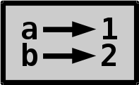
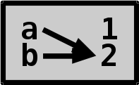

# Variables, Booleans and None

## Variables

Variables are easy to understand. They simply **point to values**.

```python
>>> a = 1   # create a variable called a that points to 1
>>> b = 2   # create another variable
>>> a       # get the value that the variable points to
1
>>> b
2
>>>
```

Let's draw a diagram of these variables.



We can also change the value of a variable after setting it.

```python
>>> a = 2    # make a point to 2 instead of 1
>>> a
2
>>>
```

So now our diagram looks like this:



Setting a variable to another variable gets the value of the other
variable and sets the first variable to point to that value.

```python
>>> a = 1
>>> b = a  # this makes b point to 1, not a
>>> a = 5
>>> b      # b didn't change when a changed
1
>>>
```

Trying to access a variable that is not defined creates an error
message.

```python
>>> thingy
Traceback (most recent call last):
  File "<stdin>", line 1, in <module>
NameError: name 'thingy' is not defined
>>>
```

Variables are simple to understand, but there are a few details that we
need to keep in mind:

- Variables always point to a value, **they never point to other
  variables**. That's why the arrows in our diagrams always go left
  to right.
- Multiple variables can point to the same value, but one variable
  cannot point to multiple values.
- The values that variables point to can point to other values also.
  We'll learn more about that when we'll talk about
  [lists](lists-and-tuples.md).

Variables are an important part of most programming languages, and they
allow programmers to write much larger programs than they could write
without variables.

Variable names are case-sensitive, like many other things in Python.

```python
>>> thing = 1
>>> THING = 2
>>> thIng = 3
>>> thing
1
>>> THING
2
>>> thIng
3
>>>
```

There are also words that cannot be used as variable names
because they are reserved by Python itself and have a special meaning. 
They are called **keywords**, and we can run `help('keywords')` 
to see the full list if we want to.
We'll learn to use most of them later in this tutorial. Trying to use a
keyword as a variable name causes a syntax error.

```python
>>> if = 123
  File "<stdin>", line 1
    if = 123
       ^
SyntaxError: invalid syntax
>>>
```

When assigning something to a variable using a `=`, the right side of
the `=` is always executed before the left side. This means that we can
do something with a variable on the right side, then assign the result
back to the same variable on the left side.

```python
>>> a = 1
>>> a = a + 1
>>> a
2
>>>
```

To do something to a variable (for example, to add something to it) we
can also use `+=`, `-=`, `*=` and `/=` instead of `+`, `-`, `*` and
`/`. The "advanced" `%=`, `//=` and `**=` also work.

```python
>>> a += 2          # a = a + 2
>>> a -= 2          # a = a - 2
>>> a *= 2          # a = a * 2
>>> a /= 2          # a = a / 2
>>>
```

This is not limited to integers.

```python
>>> a = 'hello'
>>> a *= 3
>>> a += 'world'
>>> a
'hellohellohelloworld'
>>>
```

Now we also understand why typing hello to the prompt didn't work in
the beginning of this tutorial. But we can assign something to a
variable called hello and then type hello:

```python
>>> hello = 'hello there'
>>> hello
'hello there'
>>>
```

## Good and bad variable names

Variable names can be multiple characters long. They can contain
uppercase characters, numbers and some other characters, but most of the
time we should use simple, lowercase variable names. We can also use
underscores. For example, these variable names are good:

```python
>>> magic_number = 123
>>> greeting = "Hello World!"
>>>
```

Don't use variable names like this, **these variables are _bad_**:

```python
>>> magicNumber = 3.14          # looks weird
>>> Greeting = "Hello there!"   # also looks weird
>>> x = "Hello again!"          # what the heck is x?
>>>
```

All of these variables work just fine, but other Python programmers
don't want you to use them. Most Python code doesn't use variable names
that contain UpperCase letters like `magicNumber` and `Greeting`, so
other people reading your code will think it looks weird if you use
them. The problem with `x` is that it's too short, and people have no
idea what it is. Remember that mathematicians like figuring out what x
is, but programmers hate that.

## Booleans

There are two Boolean values, True and False. In Python, and in many
other programming languages, `=` is assigning and `==` is comparing.
`a = 1` sets a to 1, and `a == 1` checks if a equals 1.

```python
>>> a = 1
>>> a == 1
True
>>> a = 2
>>> a == 1
False
>>>
```

`a == 1` is the same as `(a == 1) == True`, but `a == 1` is more
readable, so most of the time we shouldn't write `== True` anywhere.

```python
>>> a = 1
>>> a == 1
True
>>> (a == 1) == True
True
>>> a = 2
>>> a == 1
False
>>> (a == 1) == True
False
>>>
```

## None

None is Python's "nothing" value. It behaves just like any other value,
and it's often used as a default value for different kinds of things.
Right now it might seem useless but we'll find a bunch of ways to use
None later.

None's behavior on the interactive prompt might be a bit confusing at
first:

```python
>>> thingy = None
>>> thingy
>>>
```

That was weird! We set thingy to None, but typing `thingy` didn't echo
back None.

This is because the prompt never echoes back None. That is handy,
because many things result in None, and it would be annoying to see
None coming up all the time.

If we want to see a None on the interactive prompt, we can use print.

```python
>>> print(thingy)
None
>>>
```

Another confusing thing is that if we do something weird to None we get
error messages that talk about NoneType object. The NoneType object they
are talking about is always None. We'll learn more about what attributes
and calling are later.

```python
>>> None.hello    # None has no attribute 'hello'
Traceback (most recent call last):
  File "<stdin>", line 1, in <module>
AttributeError: 'NoneType' object has no attribute 'hello'
>>> None()        # None is not callable
Traceback (most recent call last):
  File "<stdin>", line 1, in <module>
TypeError: 'NoneType' object is not callable
>>>
```

## Other comparing operators

So far we've used `==`, but there are other operators also. This list
probably looks awfully long, but it's actually quite easy to learn.

| Usage     | Description                       | True examples         |
|-----------|-----------------------------------|-----------------------|
| `a == b`  | a is equal to b                   | `1 == 1`              |
| `a != b`  | a is not equal to b               | `1 != 2`              |
| `a > b`   | a is greater than b               | `2 > 1`               |
| `a >= b`  | a is greater than or equal to b   | `2 >= 1`, `1 >= 1`    |
| `a < b`   | a is less than b                  | `1 < 2`               |
| `a <= b`  | a is less than or equal to b      | `1 <= 2`, `1 <= 1`    |

We can also combine multiple comparisons. This table assumes that a and
b are Booleans.

| Usage     | Description                               | True example                      |
|-----------|-------------------------------------------|-----------------------------------|
| `a and b` | a is True and b is True                   | `1 == 1 and 2 == 2`               |
| `a or b`  | a is True, b is True or they're both True | `False or 1 == 1`, `True or True` |

`not` can be used for negations. If `value` is True, `not value` is
False, and if `value` is False, `not value` is True.

There's also `is`, but don't use it instead of `==` unless you know
what you are doing. We'll learn more about it later.

## Summary

- Variables have a name and a value. We can create or change variables
  with `name = value`.
- `thing += stuff` does the same thing as `thing = thing + stuff`.
- Use lowercase variable names and remember that programmers hate
  figuring out what x is.
- `=` means assigning and `==` means comparing.
- True and False are Booleans. Comparing values results in a Boolean.
- None is a value that we'll find useful later. When error messages say
  `NoneType object` they mean None.

***

If you have trouble with this tutorial please [tell me about
it](../contact-me.md) and I'll make this tutorial better. If you
like this tutorial, please [give it a
star](../README.md#how-can-i-thank-you-for-writing-and-sharing-this-tutorial).

You may use this tutorial freely at your own risk. See
[LICENSE](../LICENSE).

[Previous](the-way-of-the-program.md) | [Next](using-functions.md) |
[List of contents](../README.md#basics)
