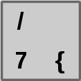

# What is programming?

**Feel free to [skip this part](#how-to-read-this-tutorial) if you
already know everything it's talking about.**

As a computer user you know that computers don't have feelings. They
don't work any faster or slower depending on if we're angry at them or
if we're happy. Computers can perform millions of calculations per
second, but they require us to tell them exactly what to do. If they do
something else than we want them to do the problem is usually that they
don't understand our instructions the way we understand them.

The only big difference between programming and what you're familiar
with already is that instead of clicking buttons to do things we write
the instructions using a **programming language**. Most programming
languages consist of English words, digits and some characters that have
special meanings.

Unlike people often think, programming is usually not complicated. Large
programs are always made of **small, simple pieces**, and those pieces
are written one by one. Programming languages are made to be used by
humans, so if there's an easy way to do something and a difficult way to
do something, you should use the easier way.

## What do I need?

First of all, **you don't need to be good at math**. Some programmers
are good at math, some are not. Programming and math are two separate
things and being good or bad at one doesn't mean you are automatically
good or bad at the other.

You also don't need a powerful computer. I could do almost all of my
programming on a 12-year-old computer if I needed to. Fast computers are
nice to work with, but you don't need them.

Programming takes time like all hobbies do. Some people learn it
quickly, and some people don't. I don't expect you to read this tutorial
in a couple hours and then master everything it's talking about. Take
your time with things, and remember that I learned to program slowly.

## Getting started

This tutorial uses a programming language called Python because it's
easy to learn and we can do many different things with it. For example,
we can create our own applications that have buttons that people can
click instead of just using applications written by others.

Before we can get started with Python we need to know how to write some of
Python's special characters with our keyboards. Unfortunately I don't know
which keys you need to press to produce these characters because your keyboard
is probably different than mine. But the keyboard can tell what you
need to press. For example, my Finnish keyboard has a key like this:

Here's what the characters on this key mean:

- I can type a number 7 by pressing this key without holding down other keys
    at the same time.
- I can type a `/` character by holding down the shift key (on the left edge
    of the keyboard, between Ctrl and CapsLock) and pressing this key.
- I can type a `{` character by holding down AltGr (on the bottom of the
    keyboard, on the right side of the spacebar) and pressing this key.
    Holding down Ctrl and Alt instead of AltGr may also work.

The only key that doesn't have anything written on it is spacebar. It's the
big, wide key that's closest to you. Another key that's used for producing
whitespace is tab, the key above CapsLock.

In this tutorial we need to know how to type these characters. We'll learn
their meanings later.

| Character | Names                                 |
|-----------|---------------------------------------|
| `+`       | plus                                  |
| `-`       | minus, dash                           |
| `_`       | underscore                            |
| `*`       | star, asterisk                        |
| `/`       | forwardslash (it's leaning forward)   |
| `\`       | backslash (it's leaning back)         |
| `=`       | equals sign                           |
| `%`       | percent sign                          |
| `.`       | dot                                   |
| `,`       | comma                                 |
| `:`       | colon                                 |
| `?`       | question mark                         |
| `!`       | exclamation mark                      |
| `<` `>`   | less-than and greater-than signs      |
| `'` `"`   | single quote and double quote         |
| `#`       | hashtag                               |
| `()`      | parentheses                           |
| `[]`      | square brackets, brackets             |
| `{}`      | curly braces, braces, curly brackets  |

That may seem like many characters, but you probably know many of them already
so it shouldn't be a problem.

## How to read this tutorial

I've done my best to make this tutorial as easy to follow as possible. Other
people have commented on this and helped me improve this a lot also. But what
should you do if you have a problem with the tutorial?

1. Try the example code yourself.
2. Read the code and the explanation for it again.
3. If there's something you haven't seen before in the tutorial and it's
    not explained, try to find it in the previous chapters.
4. If you can't find what you're looking for or you still have trouble
   understanding the tutorial or any other problems with the tutorial,
   please [tell me about it](../contact-me.md). I want to improve this
   tutorial so other readers won't have the same problem as you have.
5. See [Getting help](../getting-help.md) if you can't contact me for some
    reason.

You are free to combine this tutorial with other learning resources. If this
tutorial isn't exactly what you're looking for you don't need to stick with
nothing but this. You can find another tutorial and mix the tutorials however
you want as long as you **make sure that you understand everything you read**.

One of the most important things with learning to program is to **not
fear mistakes**. If you make a mistake, your computer will not break in
any way. You'll get an error message that tells you what's wrong and
where. Even professional programmers do mistakes and get error messages
all the time, and there's nothing wrong with it.

If you want to know what some piece of code in this tutorial does just
**try it and see**. It's practically impossible to break anything
accidentally with the things you will learn by reading this tutorial,
so you are free to try out all the examples however you want and change
them to do whatever you want.

Even though a good tutorial is an important part about learning to
program, you also need to learn to make your own things. Use what you
have learned, and create something with it.

## But reading is boring!

This chapter is probably the most boring chapter in the whole tutorial.
Other chapters contain much less text and much more code. You can also
get pretty far by just reading the code, and then reading the text only
if you don't understand the code.

## Summary

- Now you should know what programming and programming languages are.
- You don't need to be good at math and you don't need a new computer.
- Complicated programs consist of simple pieces.
- You don't need to remember how to type different characters. Just find the
    character on your keyboard and press the key, holding down shift or AltGr
    as needed.
- Make sure you understand everything you read.
- Experiment with things freely and don't fear mistakes.
- Error messages are our friends.
- Let me know if you have trouble with this tutorial.
- Now we're ready to [install Python](installing-python.md) and
    [get started](getting-started.md)!

***

If you have trouble with this tutorial please [tell me about
it](../contact-me.md) and I'll make this tutorial better. If you
like this tutorial, please [give it a
star](../README.md#how-can-i-thank-you-for-writing-and-sharing-this-tutorial).

You may use this tutorial freely at your own risk. See
[LICENSE](../LICENSE).

[Previous](../README.md) | [Next](installing-python.md) |
[List of contents](../README.md#basics)
