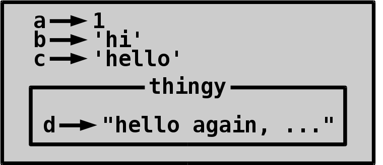

# Defining custom functions

It's probably been a while since you read about using functions.
[Read about it again](using-functions.md) if you need to.

## Why should I use custom functions?

Have a look at this code:

```py
print("************")
print("Hello World!")
print("************")

print("*************")
print("Enter a word:")
print("*************")

word = input()

if word == 'python':
    print("*******************")
    print("You entered Python!")
    print("*******************")
else:
    print("**************************")
    print("You didn't enter Python :(")
    print("**************************")
```

Then compare it to this code:

```py
print_box("Hello World!")
print_box("Enter a word:")
word = input()
if word == 'python':
    print_box("You entered Python!")
else:
    print_box("You didn't enter Python :(")
```

In this tutorial we'll learn to define a `print_box` function
that prints text in a box. We can write the code for printing the
box once, and then use it multiple times anywhere in the program.

Dividing a long program into simple functions also makes the code
easier to work with. If there's a problem with the code we can
test the functions one by one and find the problem easily.

## First functions

The `pass` keyword does nothing.

```py
>>> pass
>>> 
```

Let's use it to define a function that does nothing.

```py
>>> def do_nothing():
...     pass
... 
>>> do_nothing
<function do_nothing at 0x7f56b74e9598>
>>> 
```

Seems to be working so far, we have a function. Actually it's just
a value that is assigned to a variable called `do_nothing`. Let's see
what happens if we call it.

```py
>>> do_nothing()
>>> 
```

There we go. It did nothing at all.

Maybe we could just do something in the function instead?

```py
>>> def print_hi():
...     print("Hi!")
... 
>>> print_hi()
Hi!
>>> 
```

It's working. How about printing a variable in the function?

```py
>>> def print_message():
...     print(message)
... 
>>> message = "Hello World!"
>>> print_message()
Hello World!
>>> 
```

Again, it works. How about setting a variable in the function?

```py
>>> def get_username():
...     username = input("Username: ")
... 
>>> get_username()
Username: me
>>> username
Traceback (most recent call last):
  File "<stdin>", line 1, in <module>
NameError: name 'username' is not defined
>>> 
```

That was weird! Why didn't that work?

## Locals and globals

So far we have used nothing but **global variables**. They are called
globals because the same variables are available anywhere in our
program, even in functions.

```py
>>> a = 1
>>> b = "hi"
>>> c = "hello"
>>> def print_abc():
...     print(a, b, c)
... 
>>> print_abc()
1 hi hello
>>> 
```

But there are also **local variables**. They exist only **inside**
functions, and they are deleted when the function exits.

```py
>>> def thingy():
...     d = "hello again, i'm a local variable"
...     print('inside thingy:', d)
... 
>>> thingy()
inside thingy: hello again, i'm a local variable
>>> d
Traceback (most recent call last):
  File "<stdin>", line 1, in <module>
NameError: name 'd' is not defined
>>> 
```

Let's draw a diagram of these variables:



However, modifying a global variable in-place from a function is easy.

```py
>>> stuff = ['global stuff']
>>> def add_stuff():
...     stuff.append('local stuff')
... 
>>> add_stuff()
>>> stuff
['global stuff', 'local stuff']
>>> 
```

This doesn't work if the value is of an immutable type, like string or
integer because immutable values cannot be modified in-place.
Fortunately, Python will tell us if something's wrong.

```py
>>> foo = 1
>>> def bar():
...     foo += 1
... 
>>> bar()
Traceback (most recent call last):
  File "<stdin>", line 1, in <module>
  File "<stdin>", line 2, in bar
UnboundLocalError: local variable 'foo' referenced before assignment
>>> 
```

## Input

So far our functions seem to be really isolated from the rest of our
code, and it sucks! But they really are not as isolated as you might
think they are.

Let's think about what the print function does. It takes an argument
and prints it. Maybe a custom function could also take an argument?

```py
>>> def print_twice(message):
...     print(message)
...     print(message)
... 
>>> 
```

Here `message` is an argument. When we call the function we'll get a
local variable called message that will point to whatever we passed
to `print_twice`.

This function can be called in two ways:

- Using a **positional argument**.

    This is the recommended way for functions that take only one or two
    arguments. I would do this in my code.

    ```py
    >>> print_twice("hi")
    hi
    hi
    >>> 
    ```

    When the function was running it had a local `message` variable
    that pointed to `"hi"`. The function printed it twice.

    Positional arguments are great for simple things, but if our
    function takes many positional arguments it may be hard to tell
    which argument is which.

- Using a **keyword argument**:

    ```py
    >>> print_twice(message="hi")
    hi
    hi
    >>> 
    ```

    The name "keyword argument" is a little bit confusing because
    keyword arguments don't actually have anything to do with keywords
    (`if`, `else` etc). Keyword arguments are just a way to give names
    for our arguments.

    Keyword arguments are great when our function needs to take many
    arguments, because each argument has a name and it's easy to see
    which argument is which.

    Also note that there are no spaces around the `=` sign. That's
    because we are not assigning to a variable, we are giving the
    function a keyword argument and it can do whatever it wants with
    it.

Personally, I would use this function with a positional argument. It
only takes one argument, so I don't need to worry about which argument
is which.

Now it's time to solve our box printing problem:

```py
def print_box(message):
    print('*' * len(message))
    print(message)
    print('*' * len(message))
```

## Default values

What if we want to print different characters instead of always
printing stars?

We could change our `print_box` function to take two arguments:

```py
def print_box(message, character):
    print(character * len(message))
    print(message)
    print(character * len(message))
```

Then we could change our existing code to always call `print_box` with
a star as the second argument:

```py
print_box("Hello World", "*")
...
```

But we don't need to change our existing code. We can make the second
argument **optional** by giving it a default value.

```py
def print_box(message, character='*'):
    print(character * len(message))
    print(message)
    print(character * len(message))
```

We can print a row of stars using the function without specifying a
different character in two ways:

- Using a positional argument.

    ```py
    print_box("Hello World!")
    ```

- Using a keyword argument.

    ```py
    print_box(message="Hello World!")
    ```

Or we can give it a different character in a few different ways if we
need to:

- Using two positional arguments.

    ```py
    print_box("Enter a word:", "?")
    ```

- Using two keyword arguments.

    ```py
    print_box(message="Enter a word:", character="?")
    print_box(character="?", message="Enter a word:")
    ```

- Using one positional argument and one keyword argument.

    I would probably do this. If an argument has a default value, I
    like to use a keyword argument to change it if needed.

    ```py
    print_box("Enter a word:", character="?")
    ```

    However, this doesn't work:

    ```py
    print_box(character="?", "Enter a word:")
    ```

    The problem is that we have a keyword argument before a positional
    argument. Python doesn't allow this. We don't need to worry about
    this, because if we accidentally call a function like this we
    will get an error message.

## Output

The built-in input function returns a value. Can our function return a
value also?

```py
>>> def times_two(x):
...     return x * 2
... 
>>> times_two(3)
6
>>> times_two("hello")
'hellohello'
>>> 
```

Yes, it can.

Note that **returning from a function ends it immediately**.

```py
>>> def return_before_print():
...     return None
...     print("This never gets printed.")
... 
>>> return_before_print()
>>> 
```

If we don't have any return statements or we have a return statement
that doesn't specify what to return, our function will return None.

```py
>>> def return_none_1():
...     pass
... 
>>> def return_none_2():
...     return
... 
>>> print(return_none_1())
None
>>> print(return_none_2())
None
>>> 
```

## Return or print?

There's two ways to output information from functions. They can print
something or they can return something. So, should we print or return?

Most of the time **returning makes functions much easier to use**. Think
about the `input()` function. It asks the user to enter something, and
then the user enters something and that value is returned. If the input
function would print the value instead of returning it, things like
`name = input("Name: ")` wouldn't work and assigning the result to a
variable would be much more difficult. Printing things is fine when we
know that we'll only need to print the result and we'll never need to
assign it to a variable.

If our function returns a value we can always print it, like this:

```py
>>> def return_hi():
...     return "hi"
... 
>>> print(return_hi())
hi
>>> 
```

## Examples

Ask yes/no questions.

```py
def ask_yes_no(prompt):
    while True:
        answer = input(prompt + ' (y or n) ')
        if answer == 'y' or answer == 'Y':
            return True    # returning ends the function
        if answer == 'n' or answer == 'N':
            return False
        print("Answer 'y' or 'n'.")

if ask_yes_no("Do you like ice cream?"):
    print("You like ice cream!")
else:
    print("You don't like ice cream.")
```

Ask questions with multiple answers.

```py
def ask_until_correct(prompt, correct_options,
                      error_message="I don't know what you meant."):
    while True:
        answer = input(prompt + ' ')
        if answer in correct_options:
            return answer   # returning ends the function
        print(error_message)


colors = ['red', 'yellow', 'blue', 'green', 'orange', 'pink', 'black',
          'gray', 'white', 'brown']
choice = ask_until_correct("What's your favorite color?", colors,
                           error_message="I don't know that color.")
print("Your favorite color is %s!" % choice)
```

## Summary

- Functions are a way to write code once, and then use that same
    code in multiple places.
- Variables inside functions are **locals**, and variables outside
    functions are **globals**. Functions can access all variables, but
    by default, they can only create and change the value of local
    variables.
- Functions can take **arguments** and they can behave differently
    depending on what arguments they get. Arguments are just local
    variables.
- Functions can also **return** one value, like the built-in input
    function does. Returning also ends the function immediately.
- Return a value instead of printing it if you need to do something with
    it after calling the function.

## Exercises

**TODO:** more exercises.

**There is a lot to learn about functions, and I don't expect you to
learn everything at once.** However, there's also lots of free Python
exercises about defining functions you can do. Do many of them and
spend time with them until you're familiar with defining functions.

1. The box printing function doesn't really print a box, it prints a
    message between two lines.

        ************
        Hello World!
        ************

    Modify it to print an actual box:

        ****************
        * Hello World! *
        ****************

2. Python comes with many built-in functions. Some of the simplest ones
    are abs, all and any. They can be used like this:

    - abs returns the absolute value of its only argument.

        ```py
        >>> abs(1)
        1
        >>> abs(-1)
        1
        >>> 
        ```

    - any returns True if one or more of the elements of a list is true,
        and False otherwise.

        ```py
        >>> any([True, False, True])
        True
        >>> any([False, False, False])
        False
        >>> 
        ```

    - all returns True if all elements of a list are true, and False
        otherwise.

        ```py
        >>> all([True, True, True])
        True
        >>> all([True, False, True])
        False
        >>> 
        ```

    Define functions `my_abs`, `my_all` and `my_any` that work the same
    way without using the built-in functions. Then run the program with
    IDLE, or with `py -i file.py` on Windows or `python3 -i file.py` on
    other operating systems. Try the above examples with your
    functions.

2. Find more exercises about defining functions online.

Answers for the first and second exercise are [here](answers.md).

***

You may use this tutorial freely at your own risk. See [LICENSE](LICENSE).

[Back to the list of contents](README.md#list-of-contents)
