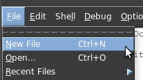

# If, else and elif

## Using if statements

Now we know what True and False are.

```py
>>> 1 == 1
True
>>> 1 == 2
False
>>>
>>> its_raining = True
>>> its_raining
True
>>>
```

But what if we want to execute different code depending on something?
That's when `if` comes in.

```py
>>> its_raining = True
>>> if its_raining:
...     print("It's raining!")
... 
It's raining!
>>> its_raining = False
>>> if its_raining:
...     print("It's raining!")        # nothing happens
... 
>>> 
```

The prompt changed from `>>>` to `...`. It meant that Python was
expecting me to keep typing. When I was done, I just pressed Enter
twice. My code was executed and the prompt went back to `>>>`.

An important thing to notice is that the line with a print is
**indented**. You can press the tab key, or if it doesn't work
just press space a few times.

IDLE does this a bit differently, so if you use IDLE, running the
example code looks more like this:

```py
>>> its_raining = True
>>> if its_raining:
        print("It's raining!")

        
It's raining!
>>> 
```

But why is that `if its_raining` instead of `if(its_raining)`?

Earlier we learned that `if` is a **keyword**.

```py
>>> if = 123
  File "<stdin>", line 1
    if = 123
       ^
SyntaxError: invalid syntax
>>> 
```

Functions like `print` need `()` after their name to work. But `if` is
a keyword, not a function, so it doesn't need `()`. Python has separate
functions and keywords because it's possible to create custom functions,
but it's not possible to create custom keywords. That's why keywords are
usually used for "magic" things that would be difficult to do with just
functions.

Also note that if statements check the condition once only, so if we
set it to false later the if statement won't notice it.

```py
>>> its_raining = True
>>> if its_raining:
...     its_raining = False
...     print("It's not raining, but this runs anyway.")
...
It's not raining, but this runs anyway.
>>>
```

## Storing code in files

At this point it's easier to put our code into a file and use it
there. If you use IDLE, go to File at top left and select New File, or
just press Ctrl+N.



If you don't use IDLE, please take the time to
[set up your editor correctly](editor-setup.md). When you're done your
editor should give you four spaces every time you press tab.

Create a file called `rain.py`, and type the following content into it:

```py
its_raining = True
if its_raining:
    print("It's raining!")
```

You can save the file anywhere you want, for example on your desktop.
Give it a name that ends with `.py`, for example `rain.py`. The `.py`
is short for Python.

Now we can run the rain program. Most editors (including IDLE) will
run our code when we press F5. If your editor doesn't, run it from
PowerShell, command prompt or terminal. You probably need to first go
to wherever you saved your file with `cd`. For example, if the file is
on your desktop, type `cd Desktop` before running the file.

Running from IDLE looks like this:

    >>> 
    ========================= RESTART: /some/place/rain.py =========================
    It's raining!
    >>> 

And running from the Windows PowerShell or command prompt looks like
this:

    C:\Users\You> cd Desktop
    C:\Users\You\Desktop> py rain.py
    It's raining!
    C:\Users\You\Desktop> 

Running from a terminal looks like this:

    you@YourComputer:~$ cd Desktop
    you@YourComputer:~/Desktop$ python3 rain.py
    It's raining!
    you@YourComputer:~/Desktop$ 

From now on, **if a code example starts with `>>>` run it on the
interactive prompt, and if it doesn't, write it to a file and run the
file**.

## Using else

What if we want to print a different message if it's not raining? We
could do something like this:

```py
its_raining = True                  # you can change this to False
its_not_raining = not its_raining   # False if its_raining, True otherwise

if its_raining:
    print("It's raining!")
if its_not_raining:
    print("It's not raining.")
```

Now our program will print a different value depending on what the
value of `its_raining` is.

We can also add `not its_raining` directly to the second if statement:

```py
its_raining = True

if its_raining:
    print("It's raining!")
if not its_raining:
    print("It's not raining.")
```

But we can make it even better by using `else`.

```py
its_raining = True

if its_raining:
    print("It's raining!")
else:
    print("It's not raining.")
```

The else part simply runs when the if statement doesn't run. It doesn't
check the condition again.

```py
>>> its_raining = True
>>> if its_raining:
...     its_raining = False
... else:
...     print("It's not raining, but this still doesn't run.")
...
>>>
```

By combining `else` with the input function we can make a program that
asks for a password and checks if it's correct.

```py
print("Hello!")
password = input("Enter your password: ")

if password == "secret":
    print("That's correct, welcome!")
else:
    print("Access denied.")
```

The program prints different things depending on what we enter.

    >>> ================================ RESTART ================================
    >>>
    Hello!
    Enter your password: secret
    Welcome!
    >>> ================================ RESTART ================================
    >>>
    Hello!
    Enter your password: lol
    Access denied.
    >>>

Using the input function for passwords doesn't work very well because
we can't hide the password with asterisks. There are better ways to get
a password from the user, but you shouldn't worry about that just yet.

## Avoiding many levels of indentation with elif

If we have more than one condition to check, our code will end up
looking a bit messy.

```py
print("Hello!")
word = input("Enter something: ")

if word == "hi":
    print("Hi to you too!")
else:
    if word == "hello":
        print("Hello hello!")
    else:
        if word == "howdy":
            print("Howdyyyy!")
        else:
            if word == "hey":
                print("Hey hey hey!")
            else:
                if word == "gday m8":
                    print("Gday 4 u 2!")
                else:
                    print("I don't know what", word, "means.")
```

Instead of typing `else`, indenting more and typing an `if` we can
simply type `elif`, which is short for `else if`. Like this:

```py
print("Hello!")
word = input("Enter something: ")

if word == "hi":
    print("Hi to you too!")
elif word == "hello":
    print("Hello hello!")
elif word == "howdy":
    print("Howdyyyy!")
elif word == "hey":
    print("Hey hey hey!")
elif word == "gday m8":
    print("Gday 4 u 2!")
else:
    print("I don't know what", word, "means.")
```

## Summary

- If a code example starts with `>>>` run it on the interactive prompt.
    If it doesn't, write it to a file and run that file.
- Indentation is important in Python.
- Indented code under an if statement runs if the condition is true.
- We can also add an else statement. Indented code under it will run
    if the code under the if statement does not run.
- elif is short for else if.

## Exercises

1. Write a program into a file that asks the user to write a word and
    then prints that word 1000 times. For example, if the user enters
    `hi` the program would reply `hihihihi...`.

2. Add spaces between the words, so the output is like `hi hi hi ...`.

3. Make something that asks the user to enter two words, and prints
    1000 of each with spaces in between. For example, if the user
    enters `hello` and `hi` the program would print
    `hello hi hello hi hello hi...`.

4. Make a program that asks for a password and prints `Welcome!`,
    `Access denied` or `You didn't enter anything` depending on whether
    the user entered the correct password, a wrong password, or nothing
    at all by pressing Enter without typing anything.

5. Make a program that asks for username and password and checks them.
    Make users "foo" and "bar" with passwords "biz" and "baz".

    Example output:

    ```
    >>> ================================ RESTART ================================
    >>> 
    Enter your username: foo
    Enter your password: biz
    Welcome foo!
    >>> ================================ RESTART ================================
    >>> 
    Enter your username: bar
    Enter your password: baz
    Welcome bar!
    >>> ================================ RESTART ================================
    >>> 
    Enter your username: spam
    Enter your password: eggs
    Wrong username.
    >>> ================================ RESTART ================================
    >>> 
    Enter your username: foo
    Enter your password: lol
    Wrong password!
    >>> 
    ```

The answers are [here](answers.md).
