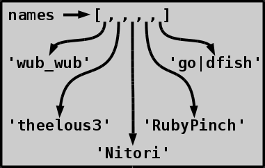
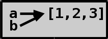
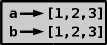

# Lists and tuples

## Why should we use lists?

Sometimes we may end up doing something like this.

```py
name1 = 'wub_wub'
name2 = 'theelous3'
name3 = 'RubyPinch'
name4 = 'go|dfish'
name5 = 'Nitori'

name = input("Enter your name: ")
if name == name1 or name == name2 or name == name3 or name == name4 or name == name5:
    print("I know you!")
else:
    print("Sorry, I don't know who you are :(")
```

This code works just fine, but there's a problem. The name check
is repetitive, and adding a new name requires adding even more
repetitive, boring checks.

## Our first list

Instead of adding a new variable for each name it might be
better to store all names in one variable. This means that our
one variable needs to point to multiple values. An easy way to
do this is using a list:

```py
names = ['wub_wub', 'theelous3', 'Nitori', 'RubyPinch', 'go|dfish']
```

Here the `names` variable points to a list, which then points to
strings, like this:



## What can we do with lists?

Let's open the `>>>` prompt and create a name list.

```py
>>> names = ['wub_wub', 'theelous3', 'RubyPinch', 'go|dfish', 'Nitori']
>>> names
['wub_wub', 'theelous3', 'RubyPinch', 'go|dfish', 'Nitori']
>>> 
```

There's many things [we can do with strings](handy-stuff-strings.md),
and some of these things also work with lists.

```py
>>> len(names)   # we have 5 names
5
>>> names + ['Akuli']   # create a new list with me in it
['wub_wub', 'theelous3', 'RubyPinch', 'go|dfish', 'Nitori', 'Akuli']
>>> ['theelous3', 'RubyPinch'] * 2    # repeating
['theelous3', 'RubyPinch', 'theelous3', 'RubyPinch']
>>> 
```

With strings indexing and slicing both returned a string, but
with lists we get a new list when we're slicing and an element
from the list if we're indexing.

```py
>>> names[:2]    # first two names
['wub_wub', 'theelous3']
>>> names[0]     # the first name
'wub_wub'
>>> 
```

If we want to check if the program knows a name all we need to
do is to use the `in` keyword.

```py
>>> 'lol' in names
False
>>> 'RubyPinch' in names
True
>>> 
```

We can't use this for checking if a list of names is a part of
our name list.

```py
>>> ['RubyPinch', 'go|dfish'] in names
False
>>> ['RubyPinch'] in names
False
>>> 
```

Lists have a few [useful
methods](https://docs.python.org/3/tutorial/datastructures.html#more-on-lists).
Some of the most commonly used ones are append, extend and
remove. append adds an item to the end of a list, extend adds
multiple items from another list and remove removes an item.

```py
>>> names
['wub_wub', 'theelous3', 'RubyPinch', 'go|dfish', 'Nitori']
>>> names.remove('theelous3')  # sorry theelous3
>>> names.remove('go|dfish')   # and sorry go|dfish
>>> names
['wub_wub', 'RubyPinch', 'Nitori']
>>> names.append('Akuli')    # let's add me here
>>> names
['wub_wub', 'RubyPinch', 'Nitori', 'Akuli']
>>> names.extend(['go|dfish', 'theelous3'])  # wb guys
>>> names
['wub_wub', 'RubyPinch', 'Nitori', 'Akuli', 'go|dfish', 'theelous3']
>>> 
```

Note that `remove` removes only the first match it finds.

```py
>>> names = ['theelous3', 'go|dfish', 'theelous3']
>>> names.remove('theelous3')
>>> names    # the second theelous3 is still there!
['go|dfish', 'theelous3']
>>> 
```

If we need to remove all matching items we can use a simple while loop.
We'll talk more about loops [in the next chapter](loops.md).

```py
>>> names = ['theelous3', 'go|dfish', 'theelous3']
>>> while 'theelous3' in names:
...     names.remove('theelous3')
... 
>>> names
['go|dfish']
>>> 
```

We can also use slicing and indexing to change the content:

```py
>>> names = ['theelous3', 'LOL', 'RubyPinch', 'go|dfish', 'Nitori']
>>> names[1] = 'wub_wub'   # replace LOL with wub_wub
>>> names
['theelous3', 'wub_wub', 'RubyPinch', 'go|dfish', 'Nitori']
>>> 
```

As you can see, **list can be changed in-place**. In other
words, they are **mutable**. Integers, floats, strings and many
other built-in types can't, so they are **immutable**.

With [strings](handy-stuff-strings.md) we did something to them
and then set the result back to the same variable, like
`message = message.strip()`. This just doesn't work right with
most mutable things because they're designed to be changed in-place.

```py
>>> names = names.remove('Akuli')
>>> print(names)     # now it's None!
None
>>> 
```

This is the same thing that happened way back when [we assigned
print's return value to a variable](using-functions.md#return-values).

## What is what?

After working with lists a while you'll find out that they
behave like this:

```py
>>> a = [1, 2, 3]
>>> b = a
>>> b.append(4)
>>> a    # this changed also!
[1, 2, 3, 4]
>>> 
```

This can be confusing at first, but it's actually easy to
explain. The problem with this code example is the `b = a`
line. If we draw a diagram of this example it looks like this:



This is when the `is` keyword comes in. It can be used to
check if two variables point to the **same** thing.

```py
>>> a is b
True
>>> 
```

Typing `[]` creates a **new** list every time.

```py
>>> [] is []
False
>>> [1, 2, 3] is [1, 2, 3]
False
>>> 
```

If we need **a new list with similar content** we can use the
`copy` method.

```py
>>> a = [1, 2, 3]
>>> b = a.copy()
>>> b is a
False
>>> b.append(4)
>>> a
[1, 2, 3]
>>> 
```

If we draw a picture of our variables in this example it looks
like this:



If you're using Python 3.2 or older you need to do `a[:]` instead
of `a.copy()`. `a[:]` is a slice of the whole list, just like
`a[0:]`.

## Tuples

Tuples are a lot like lists, but they're immutable so they
can't be changed in-place. We create them like lists, but
with `()` instead of `[]`.

```py
>>> thing = (1, 2, 3)
>>> thing
(1, 2, 3)
>>> thing = ()
>>> thing
()
>>> 
```

If we need to create a tuple that contains only one item we
need to use `(item,)` instead of `(item)` because `(item)` is
used in places like `(1 + 2) * 3`.

```py
>>> (3)
3
>>> (3,)
(3,)
>>> (1 + 2) * 3
9
>>> (1 + 2,) * 3
(3, 3, 3)
>>> 
```

Tuples don't have methods like append, extend and remove
because they can't change themselves in-place.

```py
>>> stuff = (1, 2, 3)
>>> stuff.append(4)
Traceback (most recent call last):
  File "<stdin>", line 1, in <module>
AttributeError: 'tuple' object has no attribute 'append'
>>> 
```

So, why the heck would we use tuples instead of lists? There's
a few cases when we don't want mutability, but there's also
cases when Python programmers just like to use tuples. If you
want to know more about this you can read [Ned Batchelder's blog
post about this](http://nedbatchelder.com/blog/201608/lists_vs_tuples.html).

## Summary

- Lists are a way to store multiple values in one variable.
- Lists can be changed in-place and they have methods that change them
    in-place, like append, extend and remove.
- Slicing lists returns a **new** list, and indexing them returns an
    item from them.
- `thing = another_thing` does not create a copy of `another_thing`.
- Tuples are like lists, but they can't be changed in-place. They're
    also used in different places.

## Examples

Here's the same program we had in the beginning of this tutorial, but
using a list:

```py
namelist = ['wub_wub', 'theelous3', 'RubyPinch', 'go|dfish', 'Nitori']

name = input("Enter your name: ")
if name in namelist:
    print("I know you!")
else:
    print("Sorry, I don't know who you are :(")
```

***

You may use this tutorial freely at your own risk. See
[LICENSE](LICENSE).

[Previous](handy-stuff-strings.md) | [Next](loops.md) |
[Back to the list of contents](README.md#list-of-contents)
